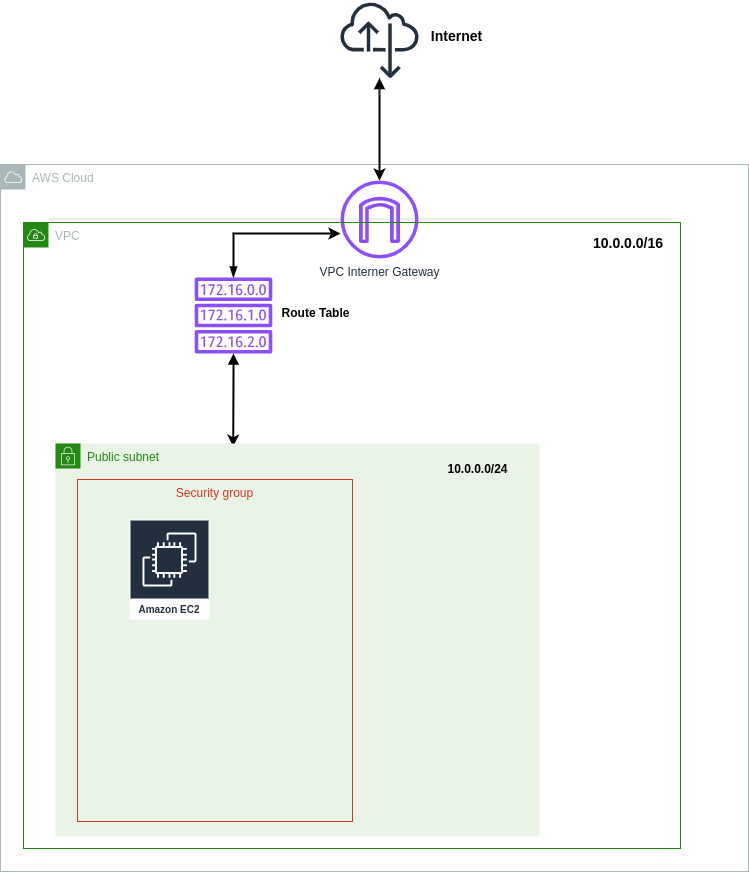

# AWS Cloudformation Mini Project
A mini project to learn about AWS Cloudformation. Launch a VPC and an EC2 instance.

## Additional Resources
1. [**AWS CloudFormation Documentation**](https://docs.aws.amazon.com/AWSCloudFormation/latest/UserGuide/Welcome.html)
2. [**AWS CloudFormation Template reference**](https://docs.aws.amazon.com/AWSCloudFormation/latest/UserGuide/template-reference.html**)
3. [**AWS CLI Cloudformation Reference - V2**](https://awscli.amazonaws.com/v2/documentation/api/latest/reference/cloudformation/index.html)
4. [**Medium Blog- By Josh Hargett**](https://awstip.com/week-10-11-aws-cloud-bootcamp-558de5b3fed7)

## Terminologies
- **A VPC (Virtual Private Cloud**) is a virtual network environment within a cloud computing service such as Amazon Web Services (AWS), Google Cloud Platform (GCP), or Microsoft Azure. It enables you to create a logically isolated section of the cloud where you can launch and manage your virtual servers, storage, and other resources.

- **A CIDR (Classless Inter-Domain Routing) range**, often referred to as a `CIDR block`, is a notation used to specify the range of IP addresses that can be assigned to the resources within a VPC. CIDR notation combines the IP address with a prefix length, represented as a slash followed by a number (e.g., /24), which indicates the number of bits used for the network portion of the IP address.

  - For example, a CIDR range of `10.0.0.0/16` represents a VPC with a network address of `10.0.0.0` and a prefix length of `16 bits`. In this case, the VPC can accommodate up to `65,536` IP addresses (2^16) ranging from `10.0.0.0` to `10.0.255.255`. The prefix length determines the number of available IP addresses within the VPC and can be adjusted to meet specific requirements.

  - CIDR ranges allow efficient allocation and management of IP addresses within a VPC, as they provide flexibility in defining the size of the network and the number of available IP addresses.

- In AWS (Amazon Web Services), a `VPC (Virtual Private Cloud)` subnet is a segmented portion of a VPC's IP address range. Subnets are used to divide a VPC into smaller, more manageable networks within the cloud environment. Each subnet resides in a specific Availability Zone (AZ) and can be associated with different resources, such as EC2 instances or RDS databases.

- AWS divides its regions into multiple isolated locations called `Availability Zones (AZs)`. Each subnet is associated with a single AZ and exists within that specific AZ. Subnets can span multiple AZs within the same region, allowing you to distribute resources across different physical infrastructure for increased availability and fault tolerance.

- **Subnets** in AWS can be categorized as either public or private. `Public subnets` are directly accessible from the internet and usually contain resources like load balancers or instances serving public-facing applications. `Private subnets`, on the other hand, do not have direct internet connectivity. They are typically used for resources that require internal communication within the VPC, such as databases or application servers.

- In AWS (Amazon Web Services), a **security group** is a fundamental component of network security that acts as a virtual firewall for your Amazon EC2 instances. It controls inbound and outbound traffic by allowing you to define rules that permit or deny specific types of network communication.

- **An internet gateway**, as mentioned in the context of AWS VPC, is a specific type of gateway that connects a private network (e.g., VPC) to the public internet. It provides a bridge between the private network and the internet, enabling communication and access to internet resources.

  - In AWS (Amazon Web Services), an **internet gateway** is a horizontally scalable, highly available AWS-managed service that allows communication between resources within a VPC (Virtual Private Cloud) and the internet. It acts as a gateway or entry point for internet traffic to enter or leave the VPC.

- In AWS (Amazon Web Services), a **route table** is a virtual networking component that controls the routing of network traffic within a Virtual Private Cloud (VPC). It acts as a set of rules that determine where network traffic is directed, allowing you to define the paths for inbound and outbound traffic within your VPC.

## Text Editors
1. [**VSCode**](https://code.visualstudio.com/)
2. [**AWS Cloud9**](https://aws.amazon.com/pm/cloud9/?trk=dcd0f000-1e1c-4a73-9f3a-f86bb6d7d1ee&sc_channel=ps&ef_id=CjwKCAjwjOunBhB4EiwA94JWsOXx1UYRpVKNvwB1IVv29PLwBmtEM-nCiLUVYT_26uAJjctYUjQ_FRoCNCQQAvD_BwE:G:s&s_kwcid=AL!4422!3!651612761006!e!!g!!aws%20cloud9!19828231353!150095226914)

## Plan
1. Create vpc
2. Create Internet Gateway
3. Create Custom Route Table
4. Create a Subnet
5. Associate subnet with Route Table
6. Create a network interface with an ip in the subnet that was created in step 4
7. Assign an elastic IP to the network interface created in step 6
8. Create Ubuntu server (EC2 instance) and install/enable apache2

## Setting up your environment
### CloudFormation Command Line Interface (CFN-CLI) and Prerequisites
- [**What is the CloudFormation Command Line Interface (CFN-CLI)?**](https://docs.aws.amazon.com/cloudformation-cli/latest/userguide/what-is-cloudformation-cli.html)

#### Install
To install the CFN-CLI run the command below

```sh
pip install cloudformation-cli cloudformation-cli-java-plugin cloudformation-cli-go-plugin cloudformation-cli-python-plugin cloudformation-cli-typescript-plugin
```
For a specific OS follow the instructions [**here**](https://docs.aws.amazon.com/cloudformation-cli/latest/userguide/what-is-cloudformation-cli.html)

### CFN-Toml
Toml Configuration for Bash scripts using CloudFormation created by [**Andrew Brown**](https://github.com/omenking) written in Ruby.
This will allow us to pull in external parameters as variables within our deploy scripts, then pass them during creation from our CFN templates. These values are normally hardcoded into the script/command to deploy the CFN template, but with Andrew's library this won't be necessary.

Go to Andrew's public repo for cfn-toml here: https://github.com/teacherseat/cfn-toml/tree/main and we walk through how to use it. We begin by installing cfn-toml through the CLI:

```sh
gem install cfn-toml
```

Extracting environment variables and parsing parameter configurations using [TOML](https://www.w3schools.io/file/toml-introduction/) for cloudformation templates.

See the configs for [**Newtork**](cloudformation-practice/aws/cfn/network/config.toml) and [**EC2**](cloudformation-practice/aws/cfn/ec2/config.toml) using toml.

### Folder structure

```
├── cloudformation-practice
│   ├── aws
│   │   └── cfn
│   │       ├── ec2
│   │       │   ├── config.toml
│   │       │   └── template.yaml
│   │       └── network
│   │           ├── config.toml
│   │           └── template.yaml
│   └── bin
│       └── cfn
│           ├── ec2-deploy
│           └── network-deploy
```

The directories in `aws/cfn` contain the cloudformation templates and configurations for the network and ec2 instance to be provisioned

The directory `bin/cfn` contains bash scripts to automate the deployment and cleanup of the network and ec2 templates.


## AWS CloudFormation Networking
- VPC
- IGW
- Route Tables
- Subnets
  - SubnetPub1
- Security Group
    - HTTP 80
    - HTTPS 443
    - SSH 22
  


1. **Create vpc**

```yaml
AWSTemplateFormatVersion: "2010-09-09"
Description: "EC2 Instance with Ubuntu Server and Apache"

Parameters:
  VpcCidrBlock:
    Type: String
    Default: 10.0.0.0/16
  SubnetCidrBlocks:
    Description: "Comma-delimited list of CIDR blocks for our private public subnets"
    Type: CommaDelimitedList
    Default: >
      10.0.0.0/24, 
      10.0.4.0/24
  Az1:
    Type: AWS::EC2::AvailabilityZone::Name
    Default: us-east-1a

Resources:
  VPC:
    # https://docs.aws.amazon.com/AWSCloudFormation/latest/UserGuide/aws-resource-ec2-vpc.html
    Type: AWS::EC2::VPC
    Properties:
      CidrBlock: !Ref VpcCidrBlock
      EnableDnsHostnames: true
      EnableDnsSupport: true
      InstanceTenancy: default
      Tags:
        - Key: Name
          Value: !Sub "${AWS::StackName}VPC"
```

The provided AWS CloudFormation template snippet defines an AWS CloudFormation stack template using the AWS CloudFormation Template Version "2010-09-09". This template is used to create AWS resources for setting up an EC2 instance running Ubuntu Server with Apache installed. Let's break down the different sections of this CloudFormation template:

- **AWSTemplateFormatVersion**:
   - This section specifies the version of the CloudFormation template format being used. In this case, it's "2010-09-09," which is a commonly used version.

- **Description**:
   - A human-readable description of the CloudFormation stack/template. In this case, it describes the purpose of the template, which is to create an EC2 instance with Ubuntu Server and Apache.

- **Parameters**:
   - This section defines input parameters that allow users to customize the behavior of the CloudFormation stack when it's created. These parameters can be provided when the stack is created or updated.
   - **VpcCidrBlock**: A parameter named `VpcCidrBlock` of type String, which is used to specify the CIDR block for the Virtual Private Cloud (VPC). The default value is "10.0.0.0/16".
   - **SubnetCidrBlocks**: A parameter named `SubnetCidrBlocks` of type CommaDelimitedList. It allows users to provide a comma-delimited list of CIDR blocks for creating private and public subnets within the VPC. The default value is a list containing two CIDR blocks, "10.0.0.0/24" and "10.0.4.0/24".
   - **Az1**: A parameter named `Az1` of type AWS::EC2::AvailabilityZone::Name. It allows users to specify an availability zone. The default value is "us-east-1a".

- **Resources**:
   - This section defines the AWS resources that will be created and managed by this CloudFormation stack.
   - **VPC**: An AWS resource of type `AWS::EC2::VPC`. This resource represents the creation of a Virtual Private Cloud (VPC).
     - **CidrBlock**: The CIDR block for the VPC is specified using the `!Ref` function, which refers to the `VpcCidrBlock` parameter. It uses the value provided for `VpcCidrBlock` when the stack is created or updated.
     - **EnableDnsHostnames** and **EnableDnsSupport**: These properties are set to true, enabling DNS hostnames and DNS resolution within the VPC.
     - **InstanceTenancy**: The tenancy of the instances launched in the VPC is set to "default," meaning they will run on shared hardware by default.
     - **Tags**: Tags are key-value pairs associated with the VPC. In this case, a tag with the key "Name" and a value generated using `!Sub` function, which substitutes `${AWS::StackName}VPC`, is attached to the VPC.

This template snippet primarily focuses on creating a VPC with customizable parameters, such as the VPC CIDR block and availability zone. Additional resources and configurations for launching an EC2 instance with Apache can be added in subsequent sections of the complete CloudFormation template, which are not included in the provided snippet.

2. **Create Internet Gateway**

```yaml
IGW:
    # https://docs.aws.amazon.com/AWSCloudFormation/latest/UserGuide/aws-resource-ec2-internetgateway.html
    Type: AWS::EC2::InternetGateway
    Properties:
      Tags:
        - Key: Name
          Value: !Sub "${AWS::StackName}IGW"
  AttachIGW:
    Type: AWS::EC2::VPCGatewayAttachment
    Properties:
      VpcId: !Ref VPC
      InternetGatewayId: !Ref IGW
```

The provided code snippet is an extension of the previous AWS CloudFormation template and defines two additional AWS resources: an Internet Gateway (IGW) and the attachment of the Internet Gateway to the Virtual Private Cloud (VPC). Let's break down this part of the template:

- **IGW**:
   - This section defines an AWS resource named `IGW`, which represents an Internet Gateway.
   - **Type**: Specifies the resource type as `AWS::EC2::InternetGateway`.
   - **Properties**:
     - **Tags**: This property is used to attach tags to the Internet Gateway. In this case, a single tag is defined with the key "Name" and a value generated using the `!Sub` function, which substitutes `${AWS::StackName}IGW`. This tag provides a human-readable name to the Internet Gateway.

- **AttachIGW**:
   - This section defines an AWS resource named `AttachIGW`, which represents the attachment of the Internet Gateway to the VPC.
   - **Type**: Specifies the resource type as `AWS::EC2::VPCGatewayAttachment`.
   - **Properties**:
     - **VpcId**: The `!Ref` function is used to reference the `VPC` resource defined earlier in the template. This property specifies the VPC to which the Internet Gateway will be attached.
     - **InternetGatewayId**: The `!Ref` function is used to reference the `IGW` resource defined earlier in the template. This property specifies the Internet Gateway that will be attached to the VPC.

In summary, this part of the template creates an Internet Gateway (IGW) and attaches it to the VPC created earlier. The attachment allows resources within the VPC to communicate with the internet. The IGW is tagged with a name for easy identification. This step is typically required when setting up a VPC for public internet access, which is often necessary for hosting web servers, load balancers, or other services that require internet connectivity.

3. **Create Custom Route Table**

```yaml
RouteTable:
    # https://docs.aws.amazon.com/AWSCloudFormation/latest/UserGuide/aws-resource-ec2-routetable.html
    Type: AWS::EC2::RouteTable
    Properties:
      VpcId: !Ref VPC
      Tags:
        - Key: Name
          Value: !Sub "${AWS::StackName}RT"
  RouteToIGW:
    # https://docs.aws.amazon.com/AWSCloudFormation/latest/UserGuide/aws-resource-ec2-route.html
    Type: AWS::EC2::Route
    DependsOn: AttachIGW
    Properties:
      RouteTableId: !Ref RouteTable
      GatewayId: !Ref IGW
      DestinationCidrBlock: 0.0.0.0/0
```

This portion of the AWS CloudFormation template continues to configure networking components within the Virtual Private Cloud (VPC) created earlier. It defines a Route Table and a default route to the Internet Gateway (IGW). Let's break down this section:

- **RouteTable**:
   - This section defines an AWS resource named `RouteTable`, which represents a route table in the VPC.
   - **Type**: Specifies the resource type as `AWS::EC2::RouteTable`.
   - **Properties**:
     - **VpcId**: The `!Ref` function is used to reference the `VPC` resource defined earlier in the template. This property specifies the VPC to which the route table belongs.
     - **Tags**: A tag with the key "Name" and a value generated using the `!Sub` function, `${AWS::StackName}RT`, is attached to the route table. This tag provides a human-readable name to the route table.

- **RouteToIGW**:
   - This section defines an AWS resource named `RouteToIGW`, which represents a route in the route table that directs traffic to the Internet Gateway (IGW).
   - **Type**: Specifies the resource type as `AWS::EC2::Route`.
   - **DependsOn**: This property specifies a dependency on the `AttachIGW` resource, ensuring that the Internet Gateway is attached to the VPC before creating this route.
   - **Properties**:
     - **RouteTableId**: The `!Ref` function is used to reference the `RouteTable` resource defined earlier in the template. This property specifies the route table to which the route will be added.
     - **GatewayId**: The `!Ref` function is used to reference the `IGW` resource defined earlier in the template. This property specifies the Internet Gateway to which the route directs traffic.
     - **DestinationCidrBlock**: This property specifies the destination CIDR block for the route. In this case, it's set to "0.0.0.0/0," which is a default route for all internet-bound traffic. Any traffic with an unknown destination will be sent to the Internet Gateway, allowing instances in the VPC to access the internet.

In summary, this part of the template creates a route table for the VPC and adds a default route that directs all internet-bound traffic to the Internet Gateway. This configuration is essential for enabling internet connectivity to resources within the VPC, making it possible for instances in the VPC to communicate with external services and the internet.

4. **Create a Subnet**

```yaml
SubnetPub1:
    # https://docs.aws.amazon.com/AWSCloudFormation/latest/UserGuide/aws-resource-ec2-subnet.html
    Type: AWS::EC2::Subnet
    Properties:
      AvailabilityZone: !Ref Az1
      CidrBlock: !Select [0, !Ref SubnetCidrBlocks]
      EnableDns64: false
      MapPublicIpOnLaunch: true #public subnet
      VpcId: !Ref VPC
      Tags:
        - Key: Name
          Value: !Sub "${AWS::StackName}SubnetPub1"
```

This section of the AWS CloudFormation template defines a public subnet within the Virtual Private Cloud (VPC) created earlier. Let's break down this part of the template:

- **SubnetPub1**:
   - This section defines an AWS resource named `SubnetPub1`, which represents a subnet within the VPC.
   - **Type**: Specifies the resource type as `AWS::EC2::Subnet`.
   - **Properties**:
     - **AvailabilityZone**: The `!Ref` function is used to reference the `Az1` parameter defined earlier in the template. This property specifies the availability zone in which the subnet will be created.
     - **CidrBlock**: The `!Select` and `!Ref` functions are used together to select the first CIDR block from the `SubnetCidrBlocks` parameter, which is a comma-delimited list of CIDR blocks provided by the user when the stack is created. This property specifies the CIDR block for the subnet.
     - **EnableDns64**: This property is set to `false`, indicating that DNS64 is not enabled for this subnet. DNS64 is used for IPv6 compatibility.
     - **MapPublicIpOnLaunch**: This property is set to `true`, indicating that instances launched in this subnet will be automatically assigned a public IP address upon launch. This is a characteristic of public subnets, which allow instances to communicate with the internet.
     - **VpcId**: The `!Ref` function is used to reference the `VPC` resource defined earlier in the template. This property specifies the VPC to which the subnet belongs.
     - **Tags**: A tag with the key "Name" and a value generated using the `!Sub` function, `${AWS::StackName}SubnetPub1`, is attached to the subnet. This tag provides a human-readable name to the subnet.

In summary, this part of the template creates a public subnet (`SubnetPub1`) within the VPC. It specifies the availability zone, CIDR block, and other properties necessary for the subnet to be considered public. Instances launched in this subnet will have public IP addresses by default, allowing them to communicate with the internet.

6. **Associate subnet with Route Table**

```yaml
SubnetPub1RTAssociation:
    # https://docs.aws.amazon.com/AWSCloudFormation/latest/UserGuide/aws-resource-ec2-subnetroutetableassociation.html
    Type: AWS::EC2::SubnetRouteTableAssociation
    Properties:
      SubnetId: !Ref SubnetPub1
      RouteTableId: !Ref RouteTable
```

This section of the AWS CloudFormation template defines a resource named `SubnetPub1RTAssociation`, which represents the association of a subnet (`SubnetPub1`) with a route table (`RouteTable`). Let's break down this part of the template:

- **SubnetPub1RTAssociation**:
   - This section defines an AWS resource named `SubnetPub1RTAssociation`, which represents the association of a subnet with a route table.
   - **Type**: Specifies the resource type as `AWS::EC2::SubnetRouteTableAssociation`.

   - **Properties**:
     - **SubnetId**: The `!Ref` function is used to reference the `SubnetPub1` resource defined earlier in the template. This property specifies the subnet to be associated with the route table.

     - **RouteTableId**: The `!Ref` function is used to reference the `RouteTable` resource defined earlier in the template. This property specifies the route table with which the subnet will be associated.

This association ensures that the subnet (`SubnetPub1`) uses the specified route table (`RouteTable`) for routing traffic. In the context of a public subnet, this association typically means that the subnet will use the route table with a default route pointing to the Internet Gateway. This configuration allows instances in the public subnet to route internet-bound traffic through the Internet Gateway.

In summary, this part of the template associates the public subnet (`SubnetPub1`) with the route table (`RouteTable`), enabling the subnet to use the appropriate routing configuration for internet connectivity.

7. **Create Security Group**

```yaml
SecurityGroup:
    # https://docs.aws.amazon.com/AWSCloudFormation/latest/UserGuide/aws-properties-ec2-security-group.html
    Type: AWS::EC2::SecurityGroup
    Properties:
      GroupName: "allow_web_traffic"
      GroupDescription: "Allow web inbound traffic"
      VpcId: !Ref VPC
      SecurityGroupIngress:
        - CidrIp: "0.0.0.0/0"
          IpProtocol: "tcp"
          FromPort: 443
          ToPort: 443
        - CidrIp: "0.0.0.0/0"
          IpProtocol: "tcp"
          FromPort: 80
          ToPort: 80
        - CidrIp: "0.0.0.0/0"
          IpProtocol: "tcp"
          FromPort: 22
          ToPort: 22
      SecurityGroupEgress:
        - CidrIp: "0.0.0.0/0"
          IpProtocol: "-1"
      Tags:
        - Key: Name
          Value: !Sub "${AWS::StackName}SG"
```

This section of the AWS CloudFormation template defines an AWS Security Group resource (`SecurityGroup`) for controlling inbound and outbound traffic to and from instances within the Virtual Private Cloud (VPC). Let's break down this part of the template:

- **SecurityGroup**:
   - This section defines an AWS resource named `SecurityGroup`, which represents an EC2 Security Group.
   - **Type**: Specifies the resource type as `AWS::EC2::SecurityGroup`.

   - **Properties**:
     - **GroupName**: Specifies the name of the security group as "allow_web_traffic".
     - **GroupDescription**: Provides a description for the security group as "Allow web inbound traffic".
     - **VpcId**: The `!Ref` function is used to reference the `VPC` resource defined earlier in the template. This property specifies the VPC to which the security group belongs.

     - **SecurityGroupIngress**: This property defines the inbound rules for allowing incoming traffic to instances associated with this security group.
       - Three inbound rules are defined:
         - Allow inbound traffic on TCP port 443 (HTTPS) from any source IP address ("0.0.0.0/0").
         - Allow inbound traffic on TCP port 80 (HTTP) from any source IP address ("0.0.0.0/0").
         - Allow inbound traffic on TCP port 22 (SSH) from any source IP address ("0.0.0.0/0").

     - **SecurityGroupEgress**: This property defines the outbound rules for allowing outgoing traffic from instances associated with this security group.
       - One outbound rule is defined, allowing all outbound traffic to any destination IP address ("0.0.0.0/0").

     - **Tags**: A tag with the key "Name" and a value generated using the `!Sub` function, `${AWS::StackName}SG`, is attached to the security group. This tag provides a human-readable name to the security group.

This security group is configured to allow incoming traffic on common web ports (HTTP, HTTPS) and SSH for administrative access. The outbound rule allows all outbound traffic, which is a permissive configuration.

In practice, this security group can be associated with EC2 instances to control their inbound and outbound network traffic according to the defined rules. For example, if you associate this security group with a web server instance, it will be able to accept HTTP, HTTPS, and SSH traffic from any source, and it can send traffic to any destination.

### Outputs

```yaml
Outputs:
  VpcId:
    Value: !Ref VPC
    Export:
      Name: !Sub "${AWS::StackName}VpcId"
  VpcCidrBlock:
    Value: !GetAtt VPC.CidrBlock
    Export:
      Name: !Sub "${AWS::StackName}VpcCidrBlock"
  SubnetCidrBlocks:
    Value: !Join [",", !Ref SubnetCidrBlocks]
    Export:
      Name: !Sub "${AWS::StackName}SubnetCidrBlocks"
  PublicSubnetIds:
    Value: !Join
      - ","
      - - !Ref SubnetPub1
    Export:
      Name: !Sub "${AWS::StackName}PublicSubnetIds"
  AvailabilityZones:
    Value: !Join
      - ","
      - - !Ref Az1
    Export:
      Name: !Sub "${AWS::StackName}AvailabilityZones"
  SecurityGroupId:
    Value: !GetAtt SecurityGroup.GroupId
    Export:
      Name: !Sub "${AWS::StackName}SecurityGroupId"
```

The "Outputs" section of the AWS CloudFormation template defines various outputs that provide information about the resources created within the stack. These outputs can be useful for referencing resource information in other stacks or for external use. Let's break down each of the defined outputs:

1. **VpcId**:
   - This output is named "VpcId."
   - It uses the `!Ref` function to get the ID of the VPC resource created earlier in the template.
   - The `Export` section specifies that this output should be exported with a name generated using the `!Sub` function, `${AWS::StackName}VpcId`. This allows other stacks to import and use this VPC ID.

2. **VpcCidrBlock**:
   - This output is named "VpcCidrBlock."
   - It uses the `!GetAtt` function to get the CIDR block of the VPC resource (`VPC.CidrBlock`).
   - The `Export` section specifies that this output should be exported with a name generated using the `!Sub` function, `${AWS::StackName}VpcCidrBlock`. This allows other stacks to import and use this VPC CIDR block.

3. **SubnetCidrBlocks**:
   - This output is named "SubnetCidrBlocks."
   - It uses the `!Ref` function to reference the `SubnetCidrBlocks` parameter, which is a comma-delimited list of CIDR blocks for subnets.
   - The `Export` section specifies that this output should be exported with a name generated using the `!Sub` function, `${AWS::StackName}SubnetCidrBlocks`. This allows other stacks to import and use these subnet CIDR blocks as a comma-delimited list.

4. **PublicSubnetIds**:
   - This output is named "PublicSubnetIds."
   - It uses the `!Ref` function to reference the `SubnetPub1` resource, representing the public subnet.
   - The `Export` section specifies that this output should be exported with a name generated using the `!Sub` function, `${AWS::StackName}PublicSubnetIds`. This allows other stacks to import and use the ID of the public subnet.

5. **AvailabilityZones**:
   - This output is named "AvailabilityZones."
   - It uses the `!Ref` function to reference the `Az1` parameter, which represents the availability zone.
   - The `Export` section specifies that this output should be exported with a name generated using the `!Sub` function, `${AWS::StackName}AvailabilityZones`. This allows other stacks to import and use the availability zone.

6. **SecurityGroupId**:
   - This output is named "SecurityGroupId."
   - It uses the `!GetAtt` function to get the ID of the `SecurityGroup` resource created earlier in the template.
   - The `Export` section specifies that this output should be exported with a name generated using the `!Sub` function, `${AWS::StackName}SecurityGroupId`. This allows other stacks to import and use the ID of the security group.

These outputs make it convenient to reference and use essential information about the resources created in this CloudFormation stack in other stacks or for external purposes, such as configuring other AWS resources or services.

#### Deploy network stack
Make sure you are in the `cloudformation-practice` directory when running the commands below

And before deploying change the path `/home/ec2-user/environment/` in the [**scripts**](cloudformation-practice/bin/cfn/) to the correct path depending on your environment.
```sh
./bin/cfn/network-deploy
```

**Summary of the script**

```bash
#! /usr/bin/env bash
set -e # stop the execution of the script if it fails

CFN_PATH="/home/ec2-user/environment/aws/cfn/network/template.yaml"
CONFIG_PATH="/home/ec2-user/environment/aws/cfn/network/config.toml"
echo $CFN_PATH

cfn-lint $CFN_PATH

BUCKET=$(cfn-toml key deploy.bucket -t $CONFIG_PATH)
REGION=$(cfn-toml key deploy.region -t $CONFIG_PATH)
STACK_NAME=$(cfn-toml key deploy.stack_name -t $CONFIG_PATH)

aws cloudformation deploy \
  --stack-name $STACK_NAME \
  --s3-bucket $BUCKET \
  --s3-prefix networking \
  --region $REGION \
  --template-file "$CFN_PATH" \
  --no-execute-changeset \
  --tags group=test-ubuntu-networking \
  --capabilities CAPABILITY_NAMED_IAM
```

This bash script is used to deploy an AWS CloudFormation template using the AWS Command Line Interface (CLI). It follows best practices by setting some error handling and using parameterized configuration. Let's break down the script step by step:

- `set -e`:
   - This command sets the `-e` option for the script, which means that the script will immediately exit if any command returns a non-zero exit status, indicating an error. This is a good practice for ensuring that the script stops execution if something goes wrong.

- `CFN_PATH="/home/ec2-user/environment/aws/cfn/network/template.yaml"`:
   - This line sets the `CFN_PATH` variable to the path of the AWS CloudFormation template file. It assumes that the template is located at the specified path.

- `CONFIG_PATH="/home/ec2-user/environment/aws/cfn/network/config.toml"`:
   - This line sets the `CONFIG_PATH` variable to the path of a TOML configuration file that appears to contain settings for the CloudFormation deployment.

- `echo $CFN_PATH`:
   - This line simply echoes the `CFN_PATH` variable to the console for informational purposes.

- `cfn-lint $CFN_PATH`:
   - This line uses the `cfn-lint` command-line tool to perform linting or static analysis of the CloudFormation template at the specified path. It checks for potential issues or errors in the template's syntax and structure.

- `BUCKET=$(cfn-toml key deploy.bucket -t $CONFIG_PATH)`:
   - This line extracts the value of the `deploy.bucket` key from the TOML configuration file specified by `$CONFIG_PATH` using the `cfn-toml` command-line tool. It assigns the extracted value to the `BUCKET` variable. This is likely the name of an S3 bucket where CloudFormation artifacts will be stored.

- `REGION=$(cfn-toml key deploy.region -t $CONFIG_PATH)`:
   - Similar to the previous line, this line extracts the value of the `deploy.region` key from the TOML configuration file and assigns it to the `REGION` variable. This specifies the AWS region where the CloudFormation stack will be deployed.

- `STACK_NAME=$(cfn-toml key deploy.stack_name -t $CONFIG_PATH)`:
   - This line extracts the value of the `deploy.stack_name` key from the TOML configuration file and assigns it to the `STACK_NAME` variable. This is the name of the CloudFormation stack that will be created or updated.

- `aws cloudformation deploy ...`:
   - This line uses the AWS CLI to deploy the CloudFormation template.
   - `--stack-name $STACK_NAME`: Specifies the name of the CloudFormation stack.
   - `--s3-bucket $BUCKET`: Specifies the S3 bucket where CloudFormation artifacts will be stored.
   - `--s3-prefix networking`: Sets an S3 prefix for the artifacts within the bucket.
   - `--region $REGION`: Specifies the AWS region where the stack will be deployed.
   - `--template-file "$CFN_PATH"`: Specifies the path to the CloudFormation template file.
   - `--no-execute-changeset`: Indicates that the script should not actually execute any changeset; it's for previewing the changes.
   - `--tags group=test-ubuntu-networking`: Assigns a tag to the CloudFormation stack.
   - `--capabilities CAPABILITY_NAMED_IAM`: Specifies that the stack may create named IAM resources.

Overall, this script deploys a CloudFormation stack based on a template, using configuration settings stored in a TOML file. It performs linting on the template before deploying to catch potential issues early in the process.

## EC2 Instance (Ubuntu Server)

8. **Create a network interface with an ip in the subnet that was created in step 4**
9. **Assign an elastic IP to the network interface created in step 6**
10. **Create Ubuntu server (EC2 instance) and install/enable apache2**

```yaml
AWSTemplateFormatVersion: 2010-09-09

Description: |
  The ec2 instance configuration

Parameters:
  NetworkStack:
    Type: String
    Description: This is our base layer of networking components eg. VPC, Subnets
    Default: TestUbuntuNet

Resources:
  WebServerInstance:
    # https://docs.aws.amazon.com/AWSCloudFormation/latest/UserGuide/aws-properties-ec2-instance.html#aws-properties-ec2-instance--examples
    Type: AWS::EC2::Instance
    Properties:
      ImageId: "ami-053b0d53c279acc90"
      InstanceType: "t2.micro"
      KeyName: "terraform-demo"
      NetworkInterfaces: 
        - AssociatePublicIpAddress: "true"
          DeviceIndex: "0"
          GroupSet: 
            - Fn::ImportValue: !Sub ${NetworkStack}SecurityGroupId
          SubnetId: 
            Fn::Select:
              - 0  # Index 0 to get the first subnet
              - Fn::Split:
                - ","
                - Fn::ImportValue: !Sub "${NetworkStack}PublicSubnetIds"
      UserData:
        Fn::Base64: |
          #!/bin/bash
          sudo apt update -y
          sudo apt install apache2 -y
          sudo systemctl start apache2
          sudo bash -c 'echo "Cloudformation first web server" > /var/www/html/index.html'
      Tags:
        - Key: Name
          Value: "test-ubuntu-ec2-instance"

Outputs:
  ServerPublicIP:
    Description: "Public IP of the EC2 instance"
    Value: !GetAtt WebServerInstance.PublicIp

  ServerPrivateIP:
    Description: "Private IP of the EC2 instance"
    Value: !GetAtt WebServerInstance.PrivateIp

  ServerInstanceID:
    Description: "Instance ID of the EC2 instance"
    Value: !Ref WebServerInstance
```

This section of the AWS CloudFormation template defines an AWS EC2 instance resource named `WebServerInstance`. This EC2 instance is configured to run a web server (Apache) and set up some basic configurations. Additionally, the template defines several outputs to provide information about the EC2 instance. Let's break down this part of the template:

1. **WebServerInstance**:
   - This section defines an AWS resource named `WebServerInstance`, which represents an EC2 instance.
   - **Type**: Specifies the resource type as `AWS::EC2::Instance`.

   - **Properties**:
     - **ImageId**: Specifies the Amazon Machine Image (AMI) to use for the instance. In this case, it uses a specific AMI ID ("ami-053b0d53c279acc90").
     - **InstanceType**: Specifies the instance type as "t2.micro," which is a low-cost, general-purpose instance type.
     - **KeyName**: Specifies the key pair to associate with the instance for SSH access.
     - **NetworkInterfaces**: Defines the network interface configuration for the instance.
       - **AssociatePublicIpAddress**: Sets to "true," indicating that the instance should be assigned a public IP address.
       - **DeviceIndex**: Specifies the device index as "0" for the network interface.
       - **GroupSet**: Associates a security group with the instance. It imports the security group ID from another stack using `Fn::ImportValue`.
       - **SubnetId**: Specifies the subnet in which the instance will be launched. It selects the first public subnet ID from a comma-delimited list of public subnet IDs imported from another stack.

     - **UserData**: Contains a script that will be executed when the instance is launched. This script updates the package repository, installs Apache, starts the Apache service, and creates a simple "index.html" file.

     - **Tags**: Attaches a tag to the instance with the key "Name" and a value of "test-ubuntu-ec2-instance" for easy identification.

2. **Outputs**:
   - This section defines several outputs to provide information about the EC2 instance.
   - **ServerPublicIP**: Provides the public IP address of the EC2 instance using the `!GetAtt` function.
   - **ServerPrivateIP**: Provides the private IP address of the EC2 instance using the `!GetAtt` function.
   - **ServerInstanceID**: Provides the instance ID of the EC2 instance using the `!Ref` function.

These outputs are helpful for obtaining information about the launched EC2 instance, such as its public and private IP addresses and instance ID. This information can be used for further configuration or for accessing the instance after it has been created.

#### Deploy ec2 instance stack
Make sure you are in the `cloudformation-practice` directory when running the commands below
```sh
./bin/cfn/ec2-deploy
```
